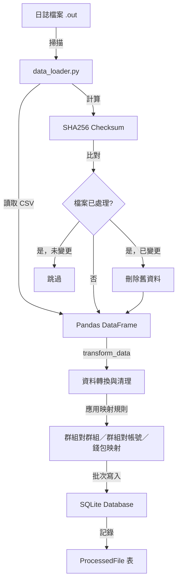
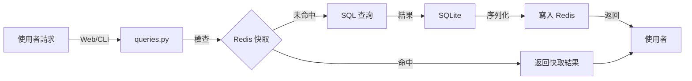
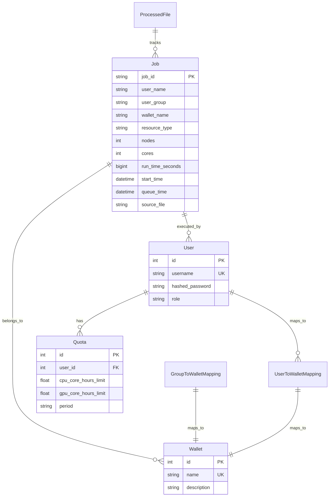

# HPC 資源帳務系統 - 架構與系統邏輯分析

## 系統概述

這是一個**HPC（高效能運算）資源帳務系統**，用於追蹤、管理與分析叢集資源的使用情況。系統支援自動化日誌處理、多維度資料查詢、帳務報表生成，以及彈性的資源歸屬管理（錢包機制）。

## 核心架構設計

### 1. 三層架構設計

```
┌─────────────────────────────────────┐
│  前端展示層 (Presentation Layer)    │
│  - Streamlit Web UI                 │
│  - Typer CLI                        │
└──────────────┬──────────────────────┘
               │
┌──────────────▼──────────────────────┐
│  業務邏輯層 (Business Logic Layer)  │
│  - queries.py (查詢與統計)          │
│  - data_loader.py (資料載入轉換)    │
│  - database_utils.py (維運／統計)   │
│  - auth.py (認證授權)               │
└──────────────┬──────────────────────┘
               │
┌──────────────▼──────────────────────┐
│  資料持久層 (Data Persistence Layer)│
│  - database.py (ORM 模型)           │
│  - SQLite 資料庫                    │
│  - Redis 快取                       │
└─────────────────────────────────────┘
```

### 2. 資料流程

#### 2.1 資料載入流程



#### 2.2 查詢與展示流程



### 3. 資料庫設計

#### 3.1 核心資料表

**jobs 表** - 儲存作業記錄
- 主要欄位：`job_id`, `job_name`, `user_name`, `user_group`, `queue`, `job_status`, `nodes`, `cores`, `memory`, `run_time_seconds`, `queue_time`, `start_time`, `elapse_limit_seconds`, `resource_type`, `wallet_name`, `source_file`
- 單欄索引（節錄）：`job_id`（unique）、`user_name`、`user_group`、`queue`、`resource_type`、`wallet_name`、`source_file` 等
- 複合索引（常見時間區間＋維度查詢）：例如 `ix_jobs_start_time`／`ix_jobs_queue_time`、`ix_jobs_start_time_resource_type`、`ix_jobs_start_time_wallet_name`、`ix_jobs_start_time_user_name`、`ix_jobs_start_time_user_group_resource_type`、`ix_jobs_start_time_resource_type_metrics`、`ix_jobs_queue_time_start_time`（定義於 `database.py` 的 `Job.__table_args__`，並由 Alembic migration `c5892216` 套用到既有庫）

**wallets 表** - 錢包（資源歸屬單位）
- 欄位：`id`, `name`, `description`
- 用途：將資源使用歸屬到特定帳務單位

**users 表** - 使用者帳戶
- 欄位：`id`, `username`, `hashed_password`, `role`
- 角色：`user` 或 `admin`

**quotas 表** - 資源使用額度
- 欄位：`id`, `user_id`, `cpu_core_hours_limit`, `gpu_core_hours_limit`, `period`
- 用途：定義使用者的資源使用上限

**processed_files 表** - 已處理檔案記錄
- 欄位：`id`, `filename`, `checksum`
- 用途：追蹤已載入的日誌檔案，避免重複處理

#### 3.2 映射機制表

系統使用多層映射規則來決定資源歸屬：

1. **GroupToGroupMapping** - 群組標準化映射
   - 將來源群組名稱對應到標準化的目標群組名稱
   - 用途：統一不同的群組命名方式

2. **GroupMapping** - 群組→系統帳號映射（影響寫入 jobs 的 `user_name`）
   - 欄位：`source_group`（對應轉換後的 `UserGroup`）、`target_user_id`（指向 `users.id`）
   - 在 `transform_data()` 中於 **GroupToGroupMapping 之後** 套用：若列的 `UserGroup` 命中 `source_group`，則把該列的 `UserName` 改為目標使用者的 `username`（例如將叢集帳號歸併到同一個系統使用者）
   - 之後才進行錢包映射與「自動建立不存在使用者」邏輯，故映射後的帳號才會被當成日誌中的使用者

3. **GroupToWalletMapping** - 群組→錢包映射
   - 將特定群組的所有使用歸屬到指定錢包
   - 用途：群組層級的資源歸屬管理

4. **UserToWalletMapping** - 使用者→錢包映射（優先級最高）
   - 將特定使用者的所有使用歸屬到指定錢包
   - 用途：個人層級的資源歸屬管理

**載入時映射順序（`transform_data`）**：
```
GroupToGroupMapping（改 UserGroup）
  → GroupMapping（依 UserGroup 改 UserName）
  → 錢包：預設 UserGroup → GroupToWalletMapping → UserToWalletMapping（覆寫）
  → 自動建立 users 表中尚不存在之 UserName
```

**錢包映射優先級**（僅錢包欄位）：
```
UserToWalletMapping > GroupToWalletMapping > 預設（使用 UserGroup）
```

#### 3.3 資料表關係圖



### 4. 模組架構

#### 4.1 核心模組說明

**database.py** - 資料庫層
- SQLAlchemy ORM 模型定義
- 資料庫連線：`create_engine` 使用 SQLite、`connect_args`（含 `check_same_thread`、`timeout` 作 busy wait）、連線池（`pool_pre_ping`、`pool_size` 等）
- 模組載入時對預設連線執行常用 **PRAGMA**（例如 `journal_mode=WAL`、`busy_timeout`、`cache_size`、`synchronous`、`foreign_keys` 等），以兼顧讀寫併發與效能
- 會話管理（`SessionLocal`）
- 所有資料表模型的定義

**database_utils.py** - 資料庫維運與診斷（供 CLI 呼叫）
- `analyze_database()`：執行 `ANALYZE` 更新統計
- `vacuum_database()`：以 **AUTOCOMMIT** 連線執行 `VACUUM`（避免包在 ORM 交易中導致 SQLite 失敗），並可搭配 `engine.dispose()` 釋放連線池
- `get_database_stats()`：檔案大小、PRAGMA、各表列數與索引列表等
- `explain_query_plan()`：僅允許**單一、以 SELECT 開頭**且不含分號／特定關鍵字之查詢，再執行 `EXPLAIN QUERY PLAN`
- `validate_query_for_explain()`：上述查詢之白名單檢查

**data_loader.py** - 資料載入與轉換
- `load_new_data()`: 掃描日誌目錄、處理新檔案、檢查檔案變更
- `transform_data()`: 資料清理、類型轉換、日期處理；依序套用 **GroupToGroupMapping**、**GroupMapping**、錢包映射、狀態映射與欄位更名
- `calculate_checksum()`: 檔案完整性檢查（SHA256）
- 自動建立使用者與錢包
- 支援強制重新載入特定檔案

**queries.py** - 查詢與統計
- `get_kpi_data()`: KPI 計算（總使用時數、平均執行時間、成功率等）
- `get_usage_over_time()`: 時間序列分析（日/月/季/年）
- `get_filtered_jobs()`: 分頁查詢作業列表（可選 `last_id` 游標分頁；日期篩選與其他報表一致採半開區間）
- `generate_accounting_report()`: 報表生成
- Redis 快取裝飾器（`@cache_results`）
- 多種統計查詢函數（Top Users、Top Groups、失敗率分析等）

**auth.py** - 認證與授權
- 密碼雜湊（bcrypt via passlib）
- 使用者驗證（`authenticate_user`）
- 使用者管理（`create_user`, `get_user`）
- 初始管理員建立（`create_initial_admin_user`）

**cli.py** - 命令列介面
- Typer 框架實作
- 資料載入指令（`load-data`）
- Alembic 遷移指令（完整覆蓋）；`alembic-upgrade` 之目標 revision 使用 **`--revision` / `-r`**（預設 `head`）
- 資料庫維運：`db-analyze`、`db-vacuum`、`db-stats`、`explain-query`（後兩者依 `database_utils` 實作）
- 使用者管理指令（`manage-user`）
- 錢包管理指令（`manage-wallet`）
- 映射管理指令（`manage-mapping`, `manage-group-to-wallet-mapping`, `manage-user-to-wallet-mapping`）
- 報表生成指令（`generate-report`）

#### 4.2 前端模組

**系統登入.py** - Streamlit 主程式
- 登入驗證邏輯
- Session 狀態管理（username, user_role, user_id）
- 多頁面導覽設定
- 角色權限檢查

**pages/ 目錄** - Streamlit 多頁面
- `1_📊_儀表板資訊.py` - 儀表板與 KPI 展示
- `2_📈_詳細統計資訊.py` - 詳細統計分析與圖表
- `3_⚙️_管理者控制台.py` - 管理功能（僅限 admin）：使用者管理、錢包管理、映射管理

### 5. 關鍵業務邏輯

#### 5.1 資源計算邏輯

系統針對不同資源類型採用不同的計量方式：

- **CPU 資源**：`node-hours = nodes × run_time_seconds / 3600`
  - 計算方式：以節點數乘以執行時間
  - 單位：節點小時

- **GPU 資源**：`core-hours = cores × run_time_seconds / 3600`
  - 計算方式：以核心數乘以執行時間
  - 單位：核心小時

此邏輯實現在 `queries.py` 的 `_get_resource_seconds_expression()` 函數中，使用 SQLAlchemy 的 `case` 表達式來根據資源類型選擇不同的計算方式。

#### 5.2 錢包歸屬邏輯

在 `data_loader.py` 的 `transform_data()` 中，**錢包**歸屬在已完成「群組對群組」與「群組對帳號（GroupMapping）」之後才計算；`UserName`／`UserGroup` 皆為當下列值。錢包決定順序如下：

```python
# 1. 預設使用 UserGroup
df['wallet_name'] = df['UserGroup']

# 2. 應用群組→錢包映射
group_to_wallet_dict = get_all_group_to_wallet_mappings(db)
df['wallet_name'] = df.apply(
    lambda row: group_to_wallet_dict.get(row['UserGroup'], row['wallet_name']), 
    axis=1
)

# 3. 使用者映射優先（覆蓋群組映射）
user_to_wallet_dict = get_all_user_to_wallet_mappings(db)
df['wallet_name'] = df.apply(
    lambda row: user_to_wallet_dict.get(row['UserName'], row['wallet_name']), 
    axis=1
)
```

上述優先級確保個人層級錢包設定可覆蓋群組層級；**帳號顯示名**則由前面的 **GroupMapping** 單獨處理。

#### 5.3 資料去重機制

系統使用多層機制確保資料不重複：

1. **檔案層級**：使用 `ProcessedFile` 表記錄已處理的檔案及其 checksum
2. **作業層級**：使用 `source_file` + `job_id` 作為唯一性判斷
3. **變更偵測**：當檔案 checksum 改變時，會先刪除該檔案的所有舊資料再重新載入
4. **強制重新載入**：支援 `force=True` 參數，強制刪除並重新載入指定檔案

#### 5.4 快取策略

系統使用 Redis 進行查詢結果快取，降低資料庫負載：

- **快取裝飾器**：`@cache_results(ttl_seconds=X)`
- **TTL 設定**：
  - KPI 資料：60 秒（高頻更新）
  - 時間序列資料：300 秒（5 分鐘）
  - 靜態資料（使用者/群組/佇列列表）：3600 秒（1 小時）
  - 報表資料：3600 秒（1 小時）
- **快取鍵格式**：`函數名:參數1:參數2:...`
- **序列化方式**：JSON（DataFrame 使用 `to_json()`）
- **錯誤處理**：Redis 連線失敗時自動降級到直接查詢資料庫

### 6. 配置管理

**config.ini** - 應用程式配置
- `[cluster]`: 叢集資訊
  - `cluster_name`: 叢集名稱
  - `total_cpu_nodes`: CPU 節點總數
  - `total_gpu_cores`: GPU 核心總數
- `[data]`: 資料目錄設定
  - `log_directory_path`: 日誌檔案目錄路徑（範例預設為佔位路徑；部署時請改為叢集實際目錄，見 `DEPLOY.md`）
- `[log_schema]`: 日誌檔欄位定義
  - `column_names`: 逗號分隔的欄位名稱列表

**環境變數** (`.env`)
- `DATABASE_FILE`: 資料庫檔案路徑（預設：`./resource_accounting.db`）
- `REDIS_HOST`: Redis 主機（預設：`localhost`）
- `REDIS_PORT`: Redis 埠號（預設：`6379`）

### 7. 資料庫遷移

使用 **Alembic** 進行資料庫版本控制：

- 遷移腳本位於 `alembic/versions/`
- 主要遷移歷史（節錄）：
  1. `0f61e2931c34`: 建立初始表結構
  2. `2b924cdc9f45`: 移除 `jobs.run_time_str` 等
  3. `68da61661014`: 新增錢包概念與映射表
  4. `6a3e94a3daa1`: 新增 `source_file` 欄位到 jobs 表
  5. `aeee40038c58`: 新增 `group_to_group_mappings` 表
  6. `c5892216`: 新增 jobs 效能用索引（與 `database.py` 中 `Job` 索引定義對齊）
  7. `b5c21d244111`: 合併分支（merge `c5892216` 與 `2b924cdc9f45` 等）

- 遷移管理透過 CLI 指令：
  - `alembic-upgrade` / `alembic-upgrade --revision head`（或 `-r`）：執行遷移
  - `alembic-migrate`: 產生遷移腳本
  - `alembic-history`: 查看遷移歷史

### 8. 安全機制

- **密碼雜湊**：使用 bcrypt 演算法（透過 passlib）
  - 自動加鹽
  - 高計算成本，防止暴力破解

- **角色權限**：admin 與 user 角色區分
  - admin：可存取所有功能，包括管理控制台
  - user：僅可查看自己的資料和統計

- **Session 管理**：Streamlit session state
  - 登入狀態保存在 session 中
  - 密碼不保存在 session（登入後立即刪除）
  - 每個頁面請求都會檢查登入狀態

- **CLI 認證**：管理指令需要 admin 認證
  - 互動式密碼輸入（隱藏顯示）
  - 驗證失敗則退出程式

### 9. 資料處理流程詳解

#### 9.1 日誌檔案解析

1. **檔案掃描**：定期掃描配置的日誌目錄，尋找 `.out` 檔案
2. **格式解析**：使用 Pandas 讀取空白分隔的 CSV 格式
3. **欄位對應**：根據 `config.ini` 中的 `column_names` 配置對應欄位
4. **錯誤處理**：使用 `on_bad_lines='skip'` 跳過格式錯誤的行

#### 9.2 資料轉換步驟

1. **類型轉換**：
   - 數值欄位：移除括號、非數字字元，轉換為數值型別
   - 日期欄位：組合年月日時分秒為 datetime 物件
   - 文字欄位：保持字串格式

2. **業務邏輯應用**：
   - 資源類型判斷：根據 Queue 名稱判斷 CPU/GPU
   - 群組標準化：應用 GroupToGroupMapping
   - 群組對帳號：應用 GroupMapping（命中則改寫 `UserName`）
   - 錢包歸屬：應用多層映射規則（見 §5.2）
   - 狀態映射：EXT → COMPLETED, CCL → USER_CANCELED

3. **資料驗證**：
   - 檢查必要欄位是否存在
   - 過濾無效日期資料
   - 確保數值在合理範圍內

#### 9.3 批次寫入策略

1. **去重檢查**：查詢資料庫中已存在的 job_id
2. **批次建立**：使用 `db.add_all()` 批次新增
3. **交易管理**：每個檔案處理為一個交易單位
4. **錯誤回滾**：處理失敗時自動回滾，不影響其他檔案

### 10. 查詢效能優化

#### 10.1 索引策略

除單欄索引外，`jobs` 上針對常見「時間區間＋維度」查詢建立複合索引（見 §3.1），與 `queries.py` 中依 `start_time` 範圍篩選的 KPI／趨勢／熱力圖等查詢一致。

#### 10.2 查詢優化技巧

1. **使用聚合函數**：在資料庫層進行聚合計算，減少資料傳輸
2. **時間上界一致**：多處 KPI／篩選使用 `start_time < end_date + 1 日`（半開區間），避免與 `<=` 混用造成邊界不一致
3. **分頁查詢**：
   - 預設：`order_by(start_time.desc(), id.desc())` 搭配 `offset`／`limit`，並以 `count()` 提供總筆數
   - 可選 **游標分頁**：傳入 `last_id`（主鍵 id，遞增續撈；`0` 表示從頭 `id > 0`）時改為 `id > last_id` ＋ `limit`，不計算總筆數（`total_items` 為 `None`），適合大偏移量場景
4. **條件過濾**：在 SQL 層進行過濾，而非在應用層
5. **快取熱點資料**：頻繁查詢的資料使用 Redis 快取
6. **維運**：定期 `ANALYZE`（CLI `db-analyze`）有助 SQLite 查詢計劃；大量刪改後可維護窗執行 `VACUUM`（`db-vacuum`）

#### 10.3 Redis 快取設計

- **快取鍵設計**：包含函數名和所有參數，確保唯一性
- **TTL 設定**：根據資料更新頻率設定適當的過期時間
- **快取失效**：資料更新時可手動清除相關快取
- **降級策略**：Redis 不可用時自動降級到資料庫查詢

## 系統特色

1. **雙介面設計**：Web UI（易用）與 CLI（自動化），滿足不同使用場景
2. **彈性映射**：多層映射規則（含群組對帳號 **GroupMapping**）支援複雜的資源歸屬與帳務歸併需求
3. **高效快取**：Redis 快取大幅降低資料庫讀取壓力
4. **版本控制**：Alembic 確保資料庫結構變更的可追溯性與可回滾性
5. **自動化處理**：自動掃描、去重、轉換日誌資料，減少人工介入
6. **CLI 維運**：`db-analyze`／`db-vacuum`／`db-stats`／`explain-query` 輔助 SQLite 調校與除錯
7. **擴展性設計**：模組化架構，易於擴展新功能

## 擴展性考量

- **資料庫**：目前使用 SQLite，適合中小型應用。若需處理大量併發寫入或極大資料集，可考慮遷移至 PostgreSQL 或 MySQL
- **水平擴展**：Streamlit 與 CLI 可獨立部署，可透過負載平衡器進行水平擴展
- **快取層**：Redis 已整合，支援分散式快取，可部署 Redis Cluster
- **資料處理**：可擴展為非同步處理架構，使用 Celery 或類似框架處理大量資料

## 未來改進方向

1. **即時監控**：整合即時作業監控功能
2. **告警機制**：資源使用超限時自動告警
3. **報表模板**：提供更多報表模板和自訂報表功能
4. **API 介面**：提供 RESTful API，支援第三方整合
5. **資料分析**：整合機器學習模型進行使用預測


